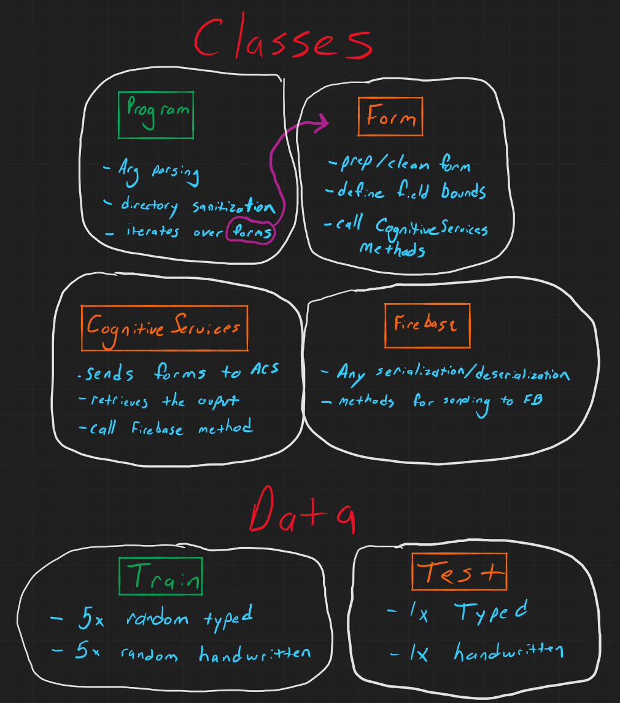

# ClaimForm-Importer

## About
A C# console app that reads CMS1500 health insurance forms from a folder, extracts the data with Azure Cognitive Services, and sends the information to Firebase.

## Usage
- Generate a `.env` file containing your Azure and Firebase API keys:
```env
ACS_KEY=<Your ACS Key>
FIREBASE_KEY=<Your Firebase Key>
```
- Run the app:
`ClaimForm.exe <source-folder>`

## Planning

