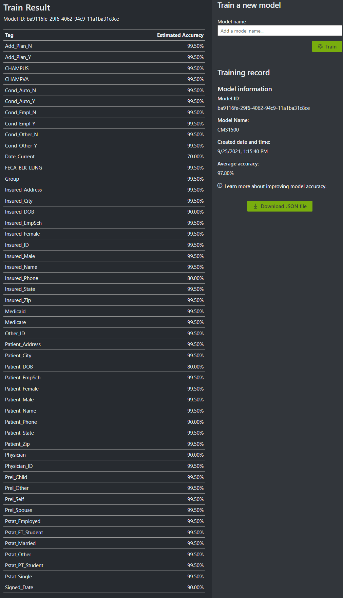

# ClaimForm-Importer

## About
A C# console app that reads CMS1500 health insurance forms from a folder, extracts the data with Azure Cognitive Services, and sends the information to Firebase.

## Usage
- Generate a `.env` file containing your Azure and Firebase API keys, as well as your FormRecognizer ModelID:
```env
ACS_KEY=<Your ACS Key>
MODEL_ID=<Your ACS FormRecognizer ModelID>
FIREBASE_KEY=<Your Firebase Key>
```
- Run the app:
`ClaimForm.exe <source-folder>`

## Planning


## Training Results
<table>
  <tr>
    <td>
      
    </td>
    <td>
      
    </td>
  </tr>
 </table>


## Potential Improvments
- Training data should have more variance in a real-world exmaple. 
  - ie. scans, mobile scans, partially handwritten, different color ink, different fonts, etc.
- ACS Output should be validated and formatted in standardized ways
- Convert `FormRecognizer.MakeRequest()` to an async function with timer to acheive a faster submission times on large folders while not exceeded API Rate limits. 
  - This would allow early results to reach Firebase while later submissions are still processing in Azure
